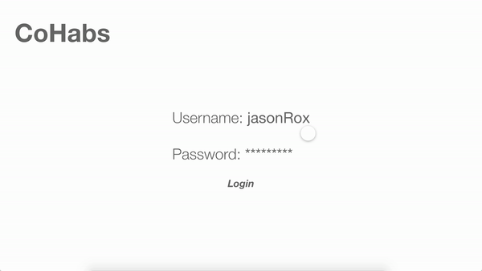
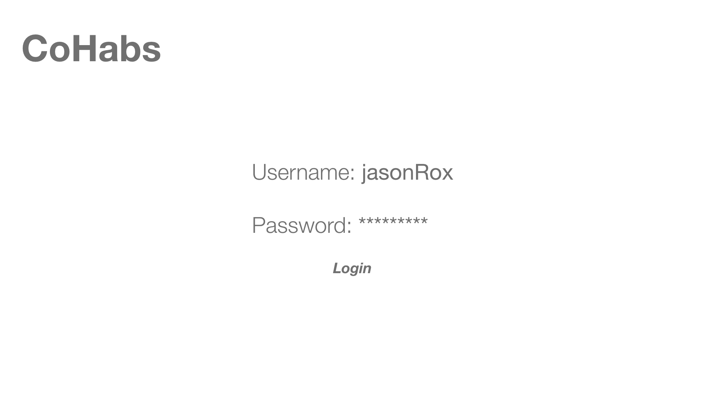
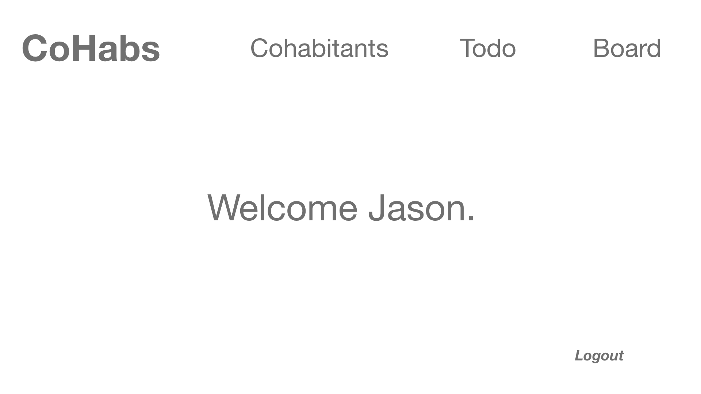
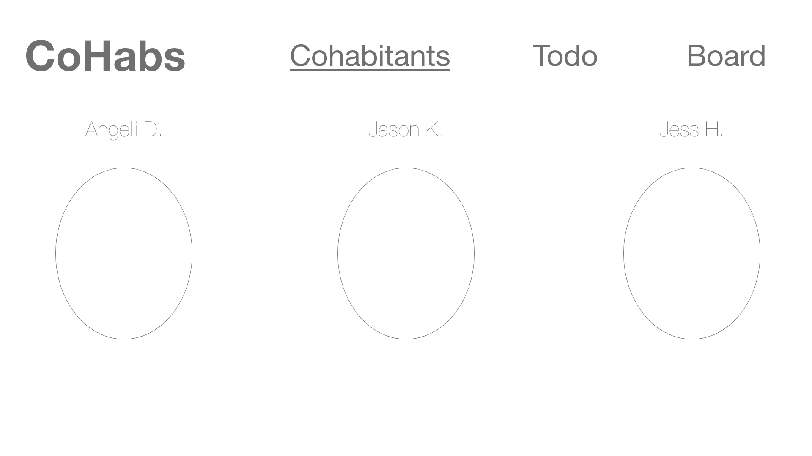
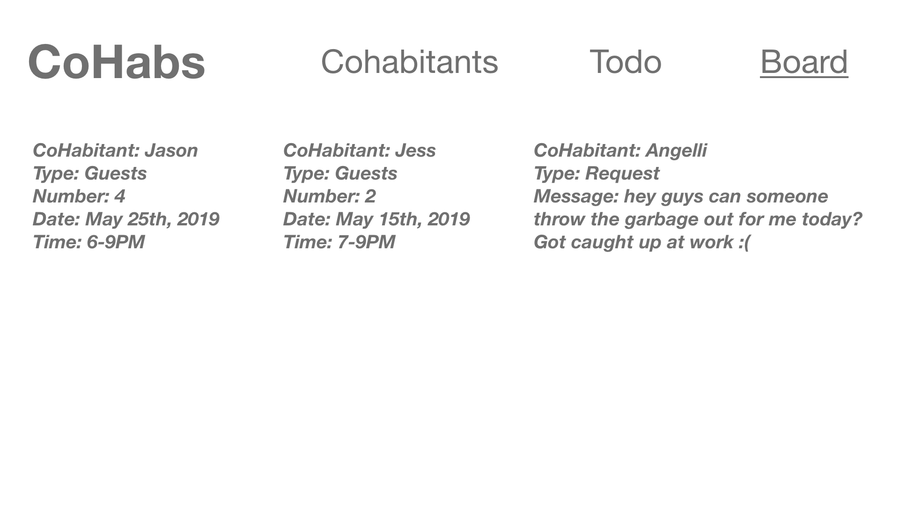

# CoHabs

Web application project for CPSC 436I.

- CoHabs is a web application that allows users to manage shared tasks, bills, and schedules among those living together under one roof. 
- Its target users are room/housemates who regularly share communal spaces and responsibilities for the household but may not always be available to organize said activities together. 
- It will store users’ personal information, task lists, invoices, receipts, and schedules. Users can access the data that pertains to them so that they know when it’s their turn to do certain chores, how much they owe/are owed for utilities, or when their roommates are having friends over. Additional functionalities can include personalized reminders, in-app messaging, and in-app payments.

## In Development 

1. Base functionalities
   - Authentication
   ```
     - Sign-up
     - Create/make profile
     ```
   - Groups
   ```
     - Create groups
     - View members
     ```
   - Tasks
   ```
     - Post/Edit/Delete Todo and board (schedules/tasks/bills)
     - View Todo and board (schedules/tasks/bills)
     ```
     
     
2. Important features 
   - Authentication
   ```
     - Log-in/reset password
     ```
   - Groups
   ```
     - Sending invites to join a group
     - Joining a group
     ```
   - Tasks
   ```
     - Assigning tasks to roommates
     ```

3. Extras
   - Tasks
   ```
     - Send email notification/reminders
     - Rotating tasks among assignees based on user input 
     ```
  
## Design








